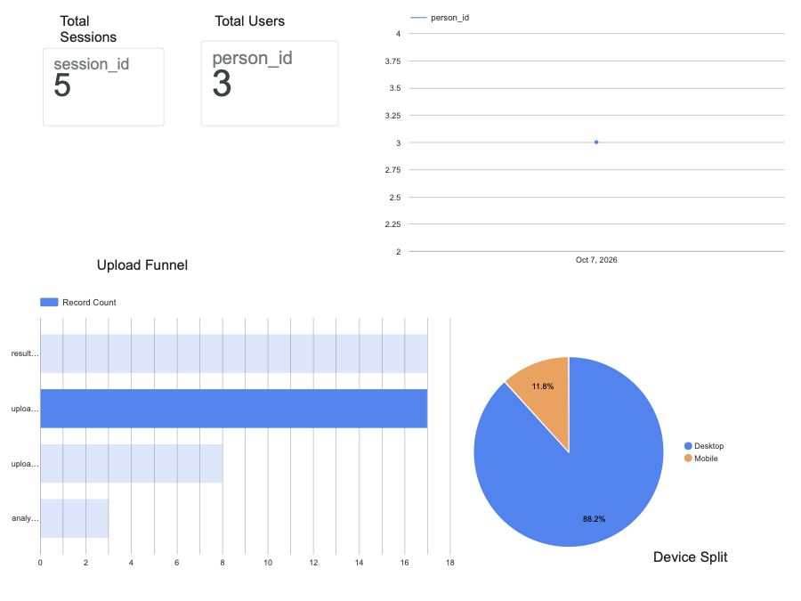

# Lawyer Lens — Product Case Study

**Live product:** [lawyerlens.in](https://lawyerlens.in)
**Analytics dashboard:** [Looker Studio dashboard](TODO-add-looker-studio-link)
**Role:** Solo founder / product manager — discovery, PRD, analytics, AI evaluation, and shipping with AI-assisted engineering.

> This repository holds the product work behind Lawyer Lens: research, metrics, evaluations, and plans. It contains no application code and no personal user data.

---

## The problem

Individuals, startup founders, and small-business owners regularly sign legal documents (leases, NDAs, service and employment agreements) that they don't fully understand. Paying a lawyer for every routine document is expensive, and existing legal AI tools are built and priced for law firms and enterprises.

## Who it's for

**Phase 1:** startup founders and small business owners in India who sign NDAs, vendor and hiring contracts. **Phase 2:** tenants with rental agreements. See the [strategy](01-case-study/strategy.md) and [GTM plan](09-gtm/gtm-onboarding-plan.md).

| Phase | Persona | Typical document | What they need |
|---|---|---|---|
| 1 | Startup founder | NDA, vendor or hiring contract | Fast review before signing |
| 1 | Small business owner | Vendor or hiring contract | Who pays what, how to exit, hidden risks |
| 2 | Tenant | Rental agreement | Plain-language answers they can trust |

## The solution

Upload a PDF and Lawyer Lens returns a **summary, key points, risks, and missing information**, then answers follow-up questions in a chat. Every answer is **grounded in the document and cites the page** it came from; when the document doesn't say, the assistant says so instead of guessing. Scanned PDFs are read with OCR.

## Key metrics (launch window: 7–8 Oct 2026)

| Metric | Value | Note |
|---|---|---|
| Unique visitors (PostHog) | 6 | Includes the founder's own testing |
| Sessions | 15 | |
| Visitors who tried to upload | 3 of 6 | |
| Activated (saw results and asked a question) | 1 of 6 | The one activated user is most likely the founder testing |
| Upload attempts | 17 | |
| **Upload failure rate** | **47% (8 of 17)** | Mobile: 2 of 2 failed; desktop: 6 of 15 |
| AI answer accuracy, eval v1 → v2 → v3 | **8/20 → 16/20 → 18/20 (90%)** | 20 questions on a sample lease deed; v3 re-tested the 4 v2 failures and 2 now pass (16 + 2 = 18) |

**Upload fix:** failed uploads never reached the server, so the cause was in the browser. The fix shipped on 7 Oct 2026: the file is copied into memory before upload, network errors retry automatically, and users see the real error. Post-fix failure rate: _TODO — measure once 1–2 weeks of post-fix data exist._

## What's in this repo

| Folder | Contents |
|---|---|
| [01-case-study](01-case-study/case-study.md) | Full case study: problem, approach, decisions, results, learnings; [strategy](01-case-study/strategy.md) |
| [02-prd](02-prd/prd-upload-failure.md) | PRD for the upload-failure fix _(template, in progress)_ |
| [03-metrics](03-metrics/metrics.md) | North Star, AARRR funnel, metric definitions, [SQL queries](03-metrics/sql/), [screenshots](03-metrics/screenshots/) |
| [04-evals](04-evals/eval-summary.md) | AI answer-quality evaluation: method, rubric, v1 → v2 results |
| [05-design](05-design/) | Screen wireframes and Figma links |
| [06-roadmap](06-roadmap/rice-roadmap.md) | RICE-scored roadmap _(template)_ |
| [07-experiments](07-experiments/ab-test-plan.md) | A/B test plan _(template)_ |
| [08-testing](08-testing/uat-test-cases.md) | UAT test cases _(template)_ |
| [09-gtm](09-gtm/gtm-onboarding-plan.md) | Go-to-market and onboarding plan |
